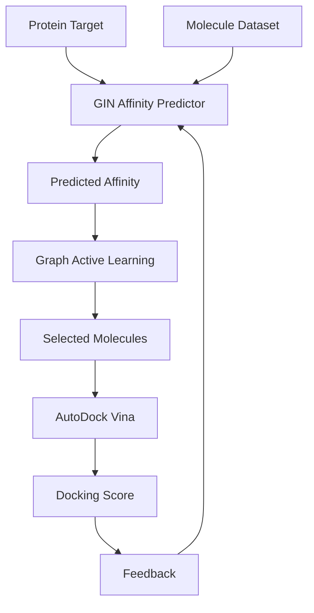
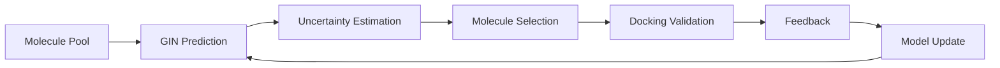

# Graph Active Learning for Docking-Efficient Protein-Ligand Discovery

## Overview

This project proposes a Graph Active Learning (GAL) framework for efficient Protein-Ligand Discovery.

Traditional virtual screening requires docking thousands or millions of molecules against a target protein, which is computationally expensive and time-consuming.

The proposed system combines:

* Graph Isomorphism Network (GIN)
* Graph Active Learning (GAL)
* AutoDock Vina Validation

to identify promising protein-binding molecules while significantly reducing the number of required docking evaluations.

The framework will be evaluated on:

* HER2
* EGFR
* KRAS

as benchmark oncology targets.

---

# Motivation

In conventional drug discovery pipelines:

```text
Protein
   ↓
Millions of Molecules
   ↓
Docking
   ↓
Ranking
```

every molecule must be evaluated, making the process expensive.

This project investigates whether Graph Active Learning can intelligently select only the most informative molecules for docking while preserving discovery performance.

---

# Research Question

Can Graph Active Learning reduce expensive docking evaluations while maintaining high-quality protein-ligand discovery performance?

---

# Core Idea

The framework consists of three major components:

## GIN (Graph Isomorphism Network)

Acts as the molecular intelligence engine.

Responsibilities:

* Learn molecular structure representations
* Understand atom-bond relationships
* Predict protein-ligand affinity

## Graph Active Learning (GAL)

Acts as the decision-making strategy.

Responsibilities:

* Identify uncertain predictions
* Select informative molecules
* Reduce unnecessary docking evaluations

## AutoDock Vina

Acts as the external validator.

Responsibilities:

* Validate predicted interactions
* Generate docking scores
* Provide feedback for model improvement

---

# System Architecture



---

# Active Learning Cycle



---

# Benchmark Targets

The framework will initially be evaluated using three oncology-related proteins.

## HER2

Human Epidermal Growth Factor Receptor 2

## EGFR

Epidermal Growth Factor Receptor

## KRAS

Kirsten Rat Sarcoma Viral Oncogene

These proteins serve as benchmark targets for validating the proposed framework.

---

# Datasets

## Protein-Ligand Interaction Data

* BindingDB
* ChEMBL
* PDBbind

## Molecular Libraries

* ChEMBL
* ZINC

---

# Technology Stack

## Graph Machine Learning

* PyTorch
* PyTorch Geometric

## Molecular Informatics

* RDKit
* Open Babel

## Docking

* AutoDock Vina

## Visualization

* PyMOL
* Discovery Studio Visualizer

## Data Processing

* NumPy
* Pandas

---

# Evaluation Metrics

## Prediction Metrics

* RMSE
* MAE
* Pearson Correlation
* Spearman Correlation

## Discovery Metrics

* Top-K Hit Rate
* Docking Success Rate
* Docking Cost Reduction

## Docking Metrics

* Binding Affinity
* Interaction Score
* Top Candidate Recovery

---

# Experimental Setup

## Baseline

GIN + Random Sampling

```text
GIN
 ↓
Random Molecule Selection
 ↓
Docking
```

## Proposed Method

GIN + Graph Active Learning

```text
GIN
 ↓
Graph Active Learning
 ↓
Smart Molecule Selection
 ↓
Docking
```

---

# Expected Contributions

1. Graph Active Learning Framework for Protein-Ligand Discovery
2. Docking-Efficient Virtual Screening Pipeline
3. Reduced Docking Computational Cost
4. Intelligent Molecule Selection Strategy
5. Automated Protein-Ligand Ranking Workflow

---

# Repository Structure

```text
project/
│
├── data/
├── notebooks/
├── models/
│   ├── gin/
│   └── active_learning/
│
├── docking/
├── evaluation/
├── visualization/
├── results/
└── README.md
```

---

# Development Environment

Recommended:

* macOS (Apple Silicon)
* Linux

Minimum Hardware:

* 16 GB RAM
* Modern Multi-Core CPU
* SSD Storage

Recommended Hardware:

* Apple M5
* 24–32 GB RAM
* 512 GB SSD

---

# Learning Resources & References

This section contains the core learning materials required for understanding the theoretical foundations and implementation of the project.

---

# Graph Neural Networks

## Primary Book

### Graph Representation Learning

Author: William L. Hamilton

Topics:

* Graph Theory
* Node Embeddings
* GraphSAGE
* GCN
* Graph Learning

Recommended Chapters:

* Chapter 1–8

---

## Foundational Papers

### Graph Convolutional Networks (GCN)

Thomas Kipf, Max Welling

Semi-Supervised Classification with Graph Convolutional Networks

Year: 2017

---

### GraphSAGE

William Hamilton et al.

Inductive Representation Learning on Large Graphs

Year: 2017

---

### Graph Attention Networks (GAT)

Petar Veličković et al.

Graph Attention Networks

Year: 2018

---

### Graph Isomorphism Network (GIN)

Key Paper for this Project

Keyulu Xu et al.

How Powerful are Graph Neural Networks?

Year: 2019

---

# Drug Target Interaction (DTI)

## Recommended Survey

Deep Learning in Drug Discovery and Medicine

Provides an overview of:

* Drug Target Interaction
* Molecular Representation
* Deep Learning Approaches

---

## Important DTI Papers

### DeepDTA

Öztürk et al.

DeepDTA:
Deep Drug-Target Binding Affinity Prediction

Year: 2018

---

### GraphDTA

Nguyen et al.

GraphDTA:
Predicting Drug-Target Binding Affinity with Graph Neural Networks

Year: 2021

Recommended as the closest baseline for this project.

---

# Active Learning

## Primary Book

### Active Learning

Author: Burr Settles

Topics:

* Uncertainty Sampling
* Query Strategies
* Pool-Based Learning
* Active Learning Theory

This is the most important Active Learning reference for the project.

---

## Important Papers

### Active Learning Literature Survey

Burr Settles

Year: 2009

---

### MolPAL

Molecule Discovery using Active Learning

Important because it combines:

* Drug Discovery
* Active Learning
* Molecular Screening

---

# Cheminformatics

## RDKit

Primary Resource:

RDKit Official Documentation

Topics:

* SMILES
* Molecular Graphs
* Fingerprints
* Molecular Descriptors

---

## Recommended Book

Practical Cheminformatics

Topics:

* Molecular Representation
* Drug-Likeness
* Similarity Search

---

# Molecular Docking

## Core Paper

### AutoDock Vina

Oleg Trott and Arthur Olson

AutoDock Vina:
Improving the Speed and Accuracy of Docking

Year: 2010

This is the docking engine used in this project.

---

## Recommended Tools

* AutoDock Vina
* PyMOL
* Discovery Studio Visualizer

---

# Protein-Ligand Databases

## BindingDB

Primary protein-ligand interaction dataset.

---

## ChEMBL

Bioactivity database.

---

## PDBbind

Protein-ligand complex database.

---

# PyTorch Geometric

## Documentation

PyTorch Geometric Official Documentation

Required Topics:

* Data
* Dataset
* DataLoader
* GINConv
* GATConv
* Global Pooling

---

# Suggested Learning Order

```text
1. Python & PyTorch
2. Graph Theory
3. GCN
4. GraphSAGE
5. GAT
6. GIN
7. RDKit
8. GraphDTA
9. AutoDock Vina
10. Active Learning
11. MolPAL
12. Full Project Implementation
```

---

# Papers Required Before Implementation

Minimum Reading List

[1] GraphSAGE (2017)

[2] GAT (2018)

[3] GIN (2019)

[4] GraphDTA (2021)

[5] AutoDock Vina (2010)

[6] Active Learning Literature Survey (2009)

[7] MolPAL

These seven papers are sufficient to begin implementation of the first project prototype.


# Future Extensions

The following features are intentionally excluded from the initial undergraduate implementation and may be explored in future work:

* Toxicity Prediction
* Off-Target Interaction Analysis
* Multi-Objective Optimization
* Molecular Dynamics Simulation
* Diffusion-Based Molecule Generation
* Foundation Models for Drug Discovery

---


# Current Status

Phase 0 — Research Planning

Planned Pipeline:

Protein → GIN → Graph Active Learning → AutoDock Vina → Feedback Loop

Target Scope:

HER2, EGFR, KRAS
