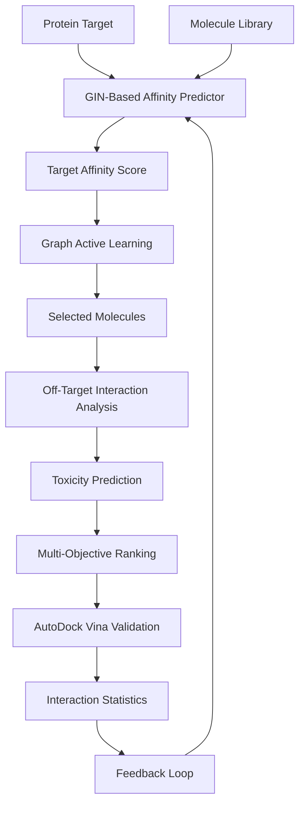
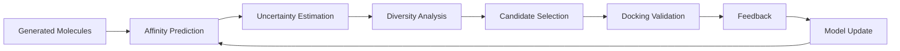

# Graph Active Learning for Selective Protein-Ligand Discovery

## Overview

Graph Active Learning for Selective Protein-Ligand Discovery is an AI-driven drug discovery framework designed to identify novel, selective, and potentially safer molecules for target proteins while minimizing expensive computational screening costs.

Unlike traditional virtual screening pipelines that focus solely on binding affinity, this framework incorporates:

* Protein-Ligand Interaction Prediction
* Graph Active Learning
* Off-Target Interaction Analysis
* Toxicity Assessment
* Docking-Based Validation
* Multi-Objective Candidate Ranking

The system aims to discover molecules that are not only strong binders to the target protein but also exhibit lower toxicity and reduced off-target interactions.

Initial evaluation will be performed on oncology-related targets including HER2, EGFR, and KRAS.

---

# Problem Statement

Traditional drug discovery pipelines often optimize only for binding affinity.

However, in real-world pharmaceutical development:

* Strong binding alone is insufficient.
* Molecules may interact with unintended proteins.
* Off-target interactions may cause side effects.
* Toxic compounds may fail in later stages.

This project addresses these challenges by integrating Active Learning, Selectivity Analysis, and Toxicity Prediction into a unified framework.

---

# Research Question

Can Graph Active Learning reduce expensive docking evaluations while discovering highly selective and low-toxicity protein-binding molecules?

---

# Objectives

## Primary Objectives

* Protein-Ligand Affinity Prediction
* Graph Active Learning-Based Molecule Selection
* Off-Target Interaction Prediction
* Toxicity Assessment
* Docking Validation using AutoDock Vina
* Interaction Statistics Generation

## Secondary Objectives

* Molecular Diversity Optimization
* Drug-Likeness Estimation
* Docking Cost Reduction
* Multi-Objective Candidate Ranking

---

# System Architecture



---

# Active Learning Workflow



---

# Multi-Objective Optimization

The framework does not optimize only for affinity.

Final molecule ranking considers:

```text
Target Affinity
+
Selectivity
+
Drug-Likeness
+
Molecular Diversity
-
Toxicity
-
Off-Target Binding
```

---

# Selectivity Analysis

The framework evaluates interactions against:

## Target Protein

* HER2
* EGFR
* KRAS

## Off-Target Proteins

Additional proteins may be incorporated to estimate:

* Cross-reactivity
* Potential side effects
* Selectivity score

---

# Toxicity Analysis

Toxicity estimation will be performed using machine learning models trained on:

* Tox21
* ClinTox

Predicted endpoints may include:

* Cytotoxicity
* Organ toxicity
* General toxicity risk

---

# Datasets

## Protein-Ligand Interaction

* BindingDB
* ChEMBL
* PDBbind

## Toxicity

* Tox21
* ClinTox

## Molecular Libraries

* ZINC
* ChEMBL

---

# Technology Stack

## AI & Deep Learning

* PyTorch
* PyTorch Geometric

## Molecular Modeling

* RDKit
* Open Babel

## Docking

* AutoDock Vina

## Visualization

* PyMOL
* Discovery Studio Visualizer

## Data Processing

* NumPy
* Pandas

---

# Evaluation Metrics

## Prediction Metrics

* RMSE
* MAE
* Pearson Correlation
* Spearman Correlation

## Discovery Metrics

* Top-K Hit Rate
* Docking Success Rate
* Docking Cost Reduction

## Drug Discovery Metrics

* Binding Affinity
* Selectivity Score
* Toxicity Score
* Drug-Likeness Score
* Molecular Diversity Score

---

# Expected Contributions

1. Graph Active Learning Framework for Drug Discovery
2. Docking-Efficient Protein-Ligand Screening
3. Selectivity-Aware Molecule Ranking
4. Toxicity-Aware Candidate Selection
5. Automated Interaction Statistics Generation
6. Multi-Objective Drug Discovery Workflow

---

# Demonstration Targets

## HER2

Human Epidermal Growth Factor Receptor 2

## EGFR

Epidermal Growth Factor Receptor

## KRAS

Kirsten Rat Sarcoma Viral Oncogene

These targets serve as benchmark proteins for evaluating the proposed framework.

---

# Future Extensions

* Molecular Dynamics Validation
* Diffusion-Based Molecule Generation
* Reinforcement Learning Optimization
* Foundation Models for Drug Discovery
* Multi-Target Drug Design
* Clinical Candidate Prioritization

---

<!-- # Repository Structure

```text
project/
│
├── data/
├── notebooks/
├── models/
│   ├── affinity/
│   ├── toxicity/
│   └── active_learning/
│
├── docking/
├── protein_processing/
├── off_target_analysis/
├── interaction_statistics/
├── evaluation/
├── visualization/
├── results/
└── README.md
```-->

## Hardware Requirements

### Minimum Development Environment

| Component | Requirement                   |
| --------- | ----------------------------- |
| CPU       | Apple M1 / Ryzen 7 / Intel i7 |
| RAM       | 16 GB                         |
| Storage   | 256 GB SSD                    |
| OS        | Linux / macOS                 |

### Recommended Development Environment

| Component | Requirement                               |
| --------- | ----------------------------------------- |
| CPU       | Apple M5 / Ryzen 7 8845HS / Intel Ultra 7 |
| RAM       | 24–32 GB                                  |
| Storage   | 512 GB SSD or higher                      |
| OS        | Linux (Preferred) or macOS                |

---

## Development Philosophy

This project prioritizes **local reproducible development**.

Cloud notebook environments such as:

* Google Colab
* Kaggle Notebooks

are intentionally not used as primary development platforms due to:

* Frequent dependency changes
* Package version incompatibilities
* RDKit installation inconsistencies
* PyTorch Geometric version conflicts
* AutoDock Vina integration issues
* Reproducibility challenges

Instead, the project is designed to run in a controlled local environment using:

* Python Virtual Environment (`venv`)
* Conda Environment
* Docker Containers (Future Support)

---

## Local Development Stack

```text
Python 3.12
PyTorch
PyTorch Geometric
RDKit
AutoDock Vina
NumPy
Pandas
Matplotlib
Open Babel
```

---

## Reproducibility Goal

A primary goal of this project is to ensure that every experiment can be reproduced on a local machine without relying on cloud-specific configurations.

The repository will maintain:

* Fixed package versions
* Dependency lock files
* Environment setup scripts
* Reproducible training pipelines

to guarantee consistent results across different systems.

---

## Computational Considerations

The proposed Graph Active Learning framework is designed to reduce expensive docking evaluations by intelligently selecting candidate molecules.

Instead of:

```text
1,000,000 Molecules
        ↓
1,000,000 Docking Runs
```

the framework aims for:

```text
1,000,000 Molecules
        ↓
Graph Neural Network Screening
        ↓
Graph Active Learning Selection
        ↓
1,000–10,000 Docking Runs
```

thereby reducing computational cost while preserving discovery performance.

---

# Current Status

Phase 0: Research Planning & System Design

Planned Architecture:

GIN + Graph Active Learning + Selectivity Analysis + Toxicity Prediction + AutoDock Vina Validation
